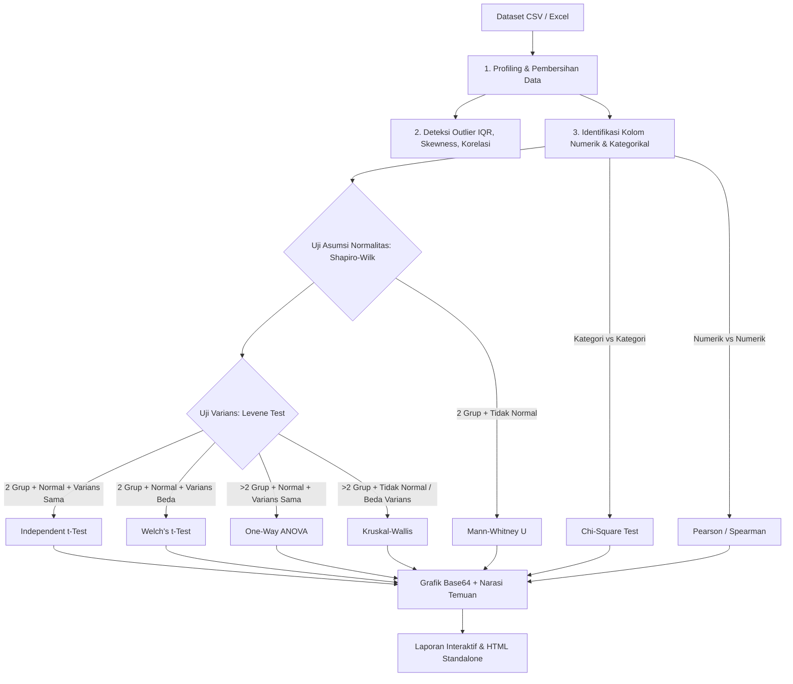

# Autonomous Exploratory Data Analyst (EDA) Agent

<div align="center">


**Platform Analisis Data Eksploratif (EDA) Otomatis Berbasis AI & Statistik Inferensial**

[Fitur Utama](#-fitur-utama) • [Cara Kerja](#-alur-kerja--arsitektur) • [Instalasi Lokal](#-panduan-instalasi-lokal) • [Panduan Deploy ke Vercel](#-panduan-deploy-ke-vercel) • [Dokumentasi API & SDK](#-penggunaan-langsung-via-python-sdk)

</div>

---

## 📖 Tentang Proyek

**Autonomous EDA Agent** adalah aplikasi web dan engine cerdas Python yang menerima dataset mentah berformat **CSV** atau **Excel** (`.xlsx`, `.xls`), lalu secara mandiri melakukan pemeriksaan statistik mendalam layaknya seorang analis data manusia profesional:

1. **Memprofilkan data** — tipe data kolom, persentase missing values, keunikan nilai, dan ringkasan statistik deskriptif.
2. **Mendeteksi anomali & pola** — deteksi outlier menggunakan metode IQR (Interquartile Range), identifikasi pasangan korelasi kuat, analisis skewness, dan deteksi kolom konstan.
3. **Memilih & menjalankan uji hipotesis inferensial** — pengujian asumsi secara otomatis (uji normalitas Shapiro-Wilk dan homogenitas varians Levene's test) sebelum memutuskan uji statistik yang tepat (uji parametrik vs non-parametrik).
4. **Visualisasi komprehensif** — menghasilkan grafik korelasi (heatmap), distribusi (histogram & KDE), boxplot grup signifikan, perbandingan scatter plot, dan diagram batang kategorikal.
5. **Menghasilkan laporan komprehensif** — menyusun narasi temuan berbasis aturan (rule-based) serta opsi analisis mendalam berbasis **Google Gemini 3.7 Flash**, lengkap dengan tombol ekspor laporan sebagai file HTML mandiri.

---

## 🚀 Fitur Utama

### 1. Mode Otomatis (Full Autonomous)
Tinggal unggah file dataset, dan agent akan langsung menjalankan seluruh tahapan profiling, pengecekan asumsi, pemilihan kombinasi uji statistik, dan visualisasi tanpa konfigurasi manual.

### 2. Mode Manual (Interactive Inspector)
Di halaman laporan, Anda dapat memilih sendiri jenis uji statistik dan pasangan kolom yang ingin diuji melalui dropdown interaktif:
- **Independent t-test / Welch's t-test**
- **Mann-Whitney U**
- **One-Way ANOVA / Kruskal-Wallis**
- **Chi-Square Test of Independence**
- **Pearson & Spearman Correlation**

### 3. Mode Prompt (AI Natural Language Query)
Cukup ketikkan instruksi bahasa sehari-hari pada kolom prompt, contoh:
> *"Bandingkan gaji (salary) berdasarkan divisi pekerjaan menggunakan uji yang paling sesuai"*  
> *"Apakah ada korelasi signifikan antara umur dan skor performa karyawan?"*

Agent akan memanfaatkan **Gemini 3.7 Flash** untuk membedah intensi instruksi menjadi spesifikasi uji terstruktur (JSON). Komputasi matematis tetap dijalankan secara presisi oleh engine Python (`scipy.stats`), sehingga bebas halusinasi angka.

### 4. Narasi AI & Keamanan Data
- **Hanya Metadata & Statistik Agregat**: Dataset mentah/baris rahasia **tidak pernah** dikirim ke API LLM. Yang dikirim hanyalah ringkasan statistik agregat (mean, p-value, nama kolom).
- **Graceful Fallback**: Jika koneksi API gagal atau tanpa API key, sistem tetap berjalan 100% menggunakan engine rule-based bawaan.
- **Model Fallback Otomatis**: Mendukung `gemini-3.7-flash` dengan failover ke `gemini-3.6-flash`, `gemini-flash-latest`, dan `gemini-2.5-flash`.

---

## 🧠 Alur Logika & Keputusan Statistik

Agent ini meniru metodologi inferensial akademis yang ketat:



---

## 📁 Struktur Repositori

```text
eda_agent_project/
├── api/
│   └── index.py            # Entry point WSGI untuk Vercel Serverless Function
├── static/
│   ├── style.css           # Styling antarmuka modern (Glassmorphism & Clean UI)
│   └── script.js           # Interaktivitas UI & tab switcher
├── templates/
│   ├── index.html          # Halaman formulir upload dataset & konfigurasi
│   ├── report.html         # Halaman visualisasi laporan hasil interaktif
│   ├── report_standalone.html # Template ekspor HTML tanpa dependensi server
│   └── _report_body.html   # Komponen modular ringkasan analisis
├── app.py                  # Server aplikasi Flask utama & route handlers
├── eda_agent.py             # Core Engine AI EDA & logika inferensi statistik
├── llm_narrator.py          # Modul integrasi Google Gemini API
├── requirements.txt        # Daftar dependensi Python
├── vercel.json             # Konfigurasi deployment serverless Vercel
├── .gitignore              # Proteksi file upload sementara & cache
└── README.md               # Dokumentasi lengkap proyek
```

---

## 💻 Panduan Instalasi Lokal

### Prasyarat
- Python 3.10 atau versi yang lebih baru
- `pip` (Python package manager)
- (Opsional) API Key Google AI Studio jika ingin mengaktifkan fitur narasi Gemini

### Langkah-langkah

1. **Clone repositori ini:**
   ```bash
   git clone https://github.com/mitnickf1/eda_agent_project.git
   cd eda_agent_project
   ```

2. **Buat dan aktifkan Virtual Environment (disarankan):**
   ```bash
   # Windows (PowerShell)
   python -m venv .venv
   .\.venv\Scripts\Activate.ps1

   # Linux / macOS
   python3 -m venv .venv
   source .venv/bin/activate
   ```

3. **Install dependensi:**
   ```bash
   pip install -r requirements.txt
   ```

4. **(Opsional) Set Gemini API Key di environment variable:**
   ```bash
   # Windows PowerShell
   $env:GEMINI_API_KEY="AIzaSy..."

   # Linux / macOS
   export GEMINI_API_KEY="AIzaSy..."
   ```

5. **Jalankan aplikasi:**
   ```bash
   python app.py
   ```
   Buka peramban Anda di alamat [http://127.0.0.1:5000](http://127.0.0.1:5000).

---

## ☁️ Panduan Deploy ke Vercel

Proyek ini telah dikonfigurasi penuh untuk berjalan di arsitektur Serverless Vercel menggunakan file [`vercel.json`](file:///c:/xampp/htdocs/eda_agent_project/vercel.json) dan [`api/index.py`](file:///c:/xampp/htdocs/eda_agent_project/api/index.py).

### Metode 1: Deploy Otomatis via GitHub (Sangat Disarankan)

1. **Push repositori ini ke akun GitHub Anda:**
   ```bash
   git remote add origin https://github.com/mitnickf1/eda_agent_project.git
   git branch -M main
   git push -u origin main
   ```

2. **Buka Dashboard Vercel:**
   - Kunjungi [vercel.com](https://vercel.com) dan login menggunakan akun GitHub Anda.
   - Klik tombol **"Add New..."** > **"Project"**.
   - Pilih repositori `eda_agent_project` yang telah di-push.

3. **Pengaturan Konfigurasi (Build and Output Settings):**
   - Framework Preset: **Other**
   - Root Directory: `./` (biarkan default)

4. **Pengaturan Environment Variables:**
   Tambahkan variabel berikut pada panel **Environment Variables**:
   | Nama Variabel | Nilai | Keterangan |
   |---------------|-------|------------|
   | `GEMINI_API_KEY` | *(API key Gemini Anda)* | Kunci Google AI Studio untuk narasi AI |
   | `SECRET_KEY` | *(String acak aman)* | Kunci sesi Flask |

5. **Klik "Deploy"**:
   Vercel akan secara otomatis membangun aplikasi serverless Anda dan menyediakan URL publik (misal: `https://eda-agent-project.vercel.app`). Setiap ada update/commit baru ke branch `main`, Vercel akan langsung melakukan auto-deploy!

---

### Metode 2: Deploy Cepat via Vercel CLI

Jika Anda ingin deploy langsung dari terminal komputer:

```bash
# Login ke akun Vercel
npx vercel login

# Deploy ke Preview Environment
npx vercel

# Deploy langsung ke Production Environment
npx vercel --prod
```

---

## 🐍 Penggunaan Langsung via Python SDK

Anda juga dapat menggunakan core engine `eda_agent.py` dan `llm_narrator.py` tanpa antarmuka web:

```python
from eda_agent import EDAAgent
from llm_narrator import generate_llm_narrative, parse_prompt_to_spec

# 1. Inisialisasi agent dengan file data
agent = EDAAgent("dataset_karyawan.csv")

# 2. Jalankan analisis menyeluruh
hasil = agent.run_full_analysis()

print("Profil Kolom:", list(hasil["profile"]["columns"].keys()))
print("Narasi Rule-based:\n", hasil["narrative"])

# 3. Menjalankan Uji Kustom via Prompt Natural Language
spec = parse_prompt_to_spec(
    "uji apakah kepuasan kerja berbeda nyata antar divisi",
    {
        "numeric_cols": hasil["profile"]["numeric_cols"],
        "categorical_cols": hasil["profile"]["categorical_cols"],
    },
    api_key="API_KEY_ANDA"
)
hasil_uji = agent.run_custom_test(spec)
print("Hasil Uji:", hasil_uji["interpretation"])
```

---

## ⚙️ Batasan & Catatan Teknis

- **Batas Ukuran Upload**: Dibatasi maksimal 25MB secara default (dapat disesuaikan pada variabel `MAX_CONTENT_LENGTH` di `app.py`).
- **Penyimpanan Serverless**: File yang diunggah diproses di direktori temporer OS (`/tmp` pada Vercel) dan otomatis dibersihkan sesuai siklus hidup serverless function.
- **Tingkat Signifikansi**: Nilai default $\alpha = 0.05$ digunakan pada seluruh uji hipotesis.
- **Sampling Shapiro-Wilk**: Dataset berukuran $>5.000$ baris per grup akan menggunakan sub-sampel acak terdistribusi 5.000 baris untuk menjaga performa komputasi tetap cepat dan akurat.

---

## 📄 Lisensi

Didistribusikan di bawah lisensi **MIT License**. Silakan gunakan, kembangkan, dan modifikasi untuk keperluan edukasi, riset, maupun komersial.

---

<div align="center">
Dikembangkan dengan ❤️ oleh <b>mitnickf1</b>
</div>
